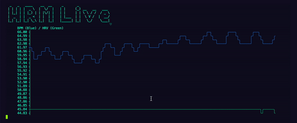

HRM Live
===

Simple heart rate monitor (HRM) CLI.



## About
Provides a live-updating view of heart rate and heart rate variability (HRV).
HRV is calculated using the root mean square of successive differences (RMSSD) of peak-to-peak (RR) intervals and taking the natural log multiplied by ten (to put HRV in a similar range as heart rate).

Built using three awesome projects:
- [@abandonware/noble](https://github.com/abandonware/noble) 
- [asciichart](https://github.com/kroitor/asciichart)
- [figlet](https://github.com/patorjk/figlet.js)

## Prerequisites
You will need to have a ready-to-pair HRM within BLE range of your computer.

## Usage
```
npm i -g hrmlive && hrmlive
```

## To Do
- Handle disconnected device gracefully
- Parse Uint16 values with care

## Contributing
1. Fork it
2. Create your feature branch (`git checkout -b feature/foo-bar`)
3. Commit your changes (`git commit -am 'Add some foo-bar'`)
4. Push to the branch (`git push origin feature/foo-bar`)
5. Create a new Pull Request

## License
[MIT](https://choosealicense.com/licenses/mit/)

